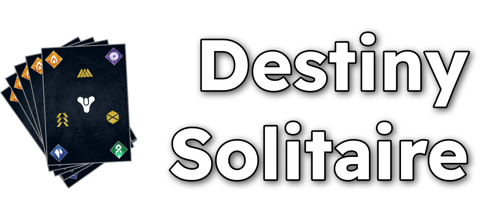

**Destiny Solitaire** is a thematic reimagining of the classic Klondike Solitaire, set within the sprawling sci-fi universe of Destiny. Master the paracausal forces, organize the chaos of the Darkness, and channel the Light to clear the board.

## 🃏 The Elemental Suits

The deck is comprised of the four fundamental elements that define the struggle between Light and Dark:

### Light

- 🟠 **Solar** – The burning fury of the Light. Represented by searing orange hues and the power of suns.
- 🟣 **Void** – The mysterious pull of the vacuum. Deep purples that signify gravity and the space between stars.

### Darkness

- 🔵 **Stasis** – The rigid, cold control of the Darkness. Shimmering blue crystals that freeze entropy.
- 🟢 **Strand** – The emerald green threads of consciousness. A psychic tapestry that connects all living things.

## 🛠 Tech Stack

Built for speed and modern standards using a cutting-edge frontend environment:

- **Runtime:** [Bun](https://bun.sh/) — Fast, all-in-one JavaScript runtime and package manager.
- **Library:** [React 19](https://react.dev/) — Utilizing the latest features of the React ecosystem.
- **Language:** TypeScript — For robust, type-safe development.
- **Bundler:** Native Bun Transpiler — Ultra-fast builds for the browser.

## 🚀 Getting Started

### Prerequisites

You must have [Bun](https://bun.sh/) installed on your machine.

### Installation

Clone the repository and install the dependencies:

```bash
bun install
```

### Development

```bash
bun dev
```

### Production Build

```bash
bun run build
```

Made with ❤️ by D3NMOH
